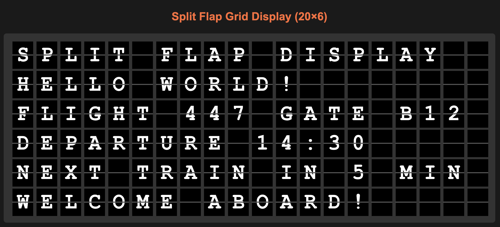

# Split Flap Display Web Component

A realistic HTML5 web component that recreates the classic split-flap display (also known as flip-dot or Solari board displays) commonly seen in airports, train stations, and retro displays.



## Features

- 🎯 **Authentic Animation**: Realistic flip animation with 3D perspective that mimics real split-flap displays
- 🔤 **Configurable Alphabet**: Support for digits, letters, and special characters via the `alphabet` attribute
- 🎵 **Sound Effects**: Authentic flip sound with randomized timing for parallel flips
- ⚡ **Sequential Animation**: Proper step-by-step progression (e.g., 1→2→3→4→5) just like real displays
- 🎨 **Technical Design**: Monospace font (JetBrains Mono) with proper character splitting
- 🔧 **Web Standards**: Built as a standard HTML5 Custom Element - no dependencies
- 📱 **Responsive**: Works across different screen sizes and devices

## Quick Start

1. Include the component script:
```html
<script src="split-flap-digit.js"></script>
```

2. Add the split-flap-digit elements:
```html
<split-flap-digit value="5"></split-flap-digit>
```

3. Change values dynamically:
```javascript
document.querySelector('split-flap-digit').setAttribute('value', '7');
```

## Examples

### Basic Usage
```html
<!-- Default: supports digits and letters -->
<split-flap-digit value="A"></split-flap-digit>

<!-- Digits only (perfect for clocks) -->
<split-flap-digit value="5" alphabet="0123456789"></split-flap-digit>

<!-- Letters only -->
<split-flap-digit value="H" alphabet="ABCDEFGHIJKLMNOPQRSTUVWXYZ"></split-flap-digit>

<!-- Extended character set -->
<split-flap-digit value="!" alphabet="0123456789ABCDEFGHIJKLMNOPQRSTUVWXYZ.,!?@#$%&*"></split-flap-digit>
```

### Digital Clock
```html
<split-flap-digit id="hour1" value="1" alphabet="0123456789"></split-flap-digit>
<split-flap-digit id="hour2" value="2" alphabet="0123456789"></split-flap-digit>
<span>:</span>
<split-flap-digit id="min1" value="3" alphabet="0123456789"></split-flap-digit>
<split-flap-digit id="min2" value="4" alphabet="0123456789"></split-flap-digit>

<script>
function updateClock() {
  const now = new Date();
  const hours = now.getHours().toString().padStart(2, '0');
  const minutes = now.getMinutes().toString().padStart(2, '0');
  
  document.getElementById('hour1').setAttribute('value', hours[0]);
  document.getElementById('hour2').setAttribute('value', hours[1]);
  document.getElementById('min1').setAttribute('value', minutes[0]);
  document.getElementById('min2').setAttribute('value', minutes[1]);
}

setInterval(updateClock, 1000);
</script>
```

### Message Display
```html
<!-- 20-character message display -->
<div class="message-board">
  <split-flap-digit value="F" alphabet="0123456789ABCDEFGHIJKLMNOPQRSTUVWXYZ "></split-flap-digit>
  <split-flap-digit value="L" alphabet="0123456789ABCDEFGHIJKLMNOPQRSTUVWXYZ "></split-flap-digit>
  <split-flap-digit value="I" alphabet="0123456789ABCDEFGHIJKLMNOPQRSTUVWXYZ "></split-flap-digit>
  <split-flap-digit value="G" alphabet="0123456789ABCDEFGHIJKLMNOPQRSTUVWXYZ "></split-flap-digit>
  <split-flap-digit value="H" alphabet="0123456789ABCDEFGHIJKLMNOPQRSTUVWXYZ "></split-flap-digit>
  <split-flap-digit value="T" alphabet="0123456789ABCDEFGHIJKLMNOPQRSTUVWXYZ "></split-flap-digit>
  <!-- ... more digits ... -->
</div>
```

## API Reference

### Attributes

| Attribute | Type | Default | Description |
|-----------|------|---------|-------------|
| `value` | string | `"0"` | The character to display |
| `alphabet` | string | `"0123456789ABCDEFGHIJKLMNOPQRSTUVWXYZ"` | The set of characters this display can show |

### Methods

```javascript
// Change the displayed value
element.setAttribute('value', 'X');

// Change the supported alphabet
element.setAttribute('alphabet', '0123456789ABCDEF');
```

### Events

The component doesn't emit custom events, but you can listen for attribute changes:

```javascript
const observer = new MutationObserver((mutations) => {
  mutations.forEach((mutation) => {
    if (mutation.type === 'attributes' && mutation.attributeName === 'value') {
      console.log('Value changed to:', mutation.target.getAttribute('value'));
    }
  });
});

observer.observe(element, { attributes: true });
```

## Animation Behavior

The split-flap display follows authentic behavior:

1. **Sequential Progression**: To change from `1` to `5`, it animates through `2`, `3`, `4`
2. **Realistic Physics**: The top half drops down while revealing the new character behind it
3. **Sound Timing**: Each flip plays a sound with slight randomization for realistic parallel operation
4. **Speed**: Fast animation (120ms per flip) for snappy response

## Demo Pages

This repository includes two demonstration pages:

### 1. Component Demo (`index.html`)
- Single digit interactive controls
- Digital clock with real-time updates
- Counter demonstration
- Alphabet cycling examples

### 2. Grid Display (`grid.html`)
- 20×6 grid of split-flap segments
- Text input for each row
- Extended character set including punctuation
- Airport/station style messaging

## Audio Requirements

The component uses `light-switch-96716.mp3` for flip sounds. Make sure this file is available in the same directory as your HTML file.

## Browser Support

- **Modern Browsers**: Chrome 54+, Firefox 63+, Safari 10.1+, Edge 79+
- **Requirements**: ES6 Custom Elements, CSS Grid, Web Audio API (for sound)
- **Graceful Degradation**: Component works without sound if audio file is missing

## Customization

### CSS Custom Properties

The component uses Shadow DOM, but you can style the host element:

```css
split-flap-digit {
  width: 80px;
  height: 100px;
  margin: 5px;
}
```

### Animation Speed

You can modify animation timing in the JavaScript source:

```javascript
// In animateFlip method
topFlap.style.animation = 'flip-top 0.12s ease-in-out forwards';  // Adjust duration
```

### Sound Customization

Replace `light-switch-96716.mp3` with your own sound file, or modify the audio setup:

```javascript
// In setupAudio method
this.audio = new Audio('your-custom-sound.mp3');
this.audio.volume = 0.5;  // Adjust volume
```

## Implementation Details

### Architecture
- **Web Component**: Built using Custom Elements v1 API
- **Shadow DOM**: Encapsulated styling and markup
- **CSS Animations**: Hardware-accelerated 3D transforms
- **Audio**: HTML5 Audio with randomized playback timing

### Performance
- **Lightweight**: ~8KB minified JavaScript, no dependencies
- **Efficient**: CSS transforms use GPU acceleration
- **Memory**: Each instance uses minimal memory footprint

## Contributing

1. Fork the repository
2. Create a feature branch (`git checkout -b feature/amazing-feature`)
3. Commit your changes (`git commit -m 'Add amazing feature'`)
4. Push to the branch (`git push origin feature/amazing-feature`)
5. Open a Pull Request

## License

This project is licensed under the MIT License - see the [LICENSE](LICENSE) file for details.

## Acknowledgments

- Inspired by classic Solari split-flap displays
- Uses JetBrains Mono font for technical appearance
- Sound effect timing inspired by real mechanical displays

---

*Perfect for retro interfaces, dashboard displays, clocks, counters, and any application requiring that classic split-flap aesthetic.*